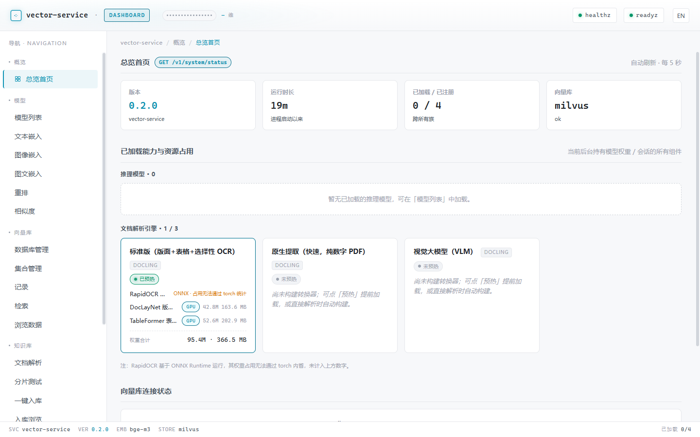
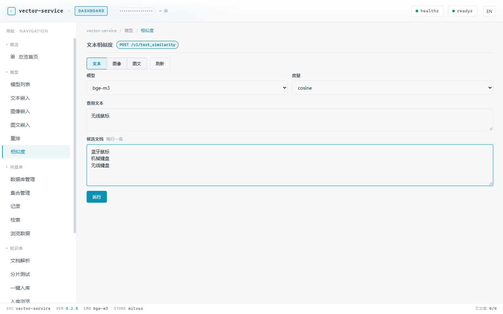

# vector-service

生产级 FastAPI 向量服务：OpenAI 兼容嵌入 + Milvus 向量库管理 + 多模态检索。

- **OpenAI 兼容嵌入 API**：`/v1/embeddings`、`/v1/models`
- **图像嵌入 API**：`/v1/image_embeddings`（OpenCLIP ViT-L/14，把 base64 图片转成 768 维向量）
- **图文跨模态嵌入 API**：`/v1/multimodal_embeddings`（Chinese-CLIP ViT-B/16，文本与图片共享 512 维投影空间，可用于文搜图 / 图搜文）
- **重排序 API**：`/v1/rerank`（cross-encoder，对向量检索结果二次重排）
- **分片检索 API**：`/v1/retrieval`（dense / BM25 / LLM 摘要多路 ANN 召回 + RRF/加权融合 + 查询改写 + MMR + 重排）
- **异步文档摄取**：`POST /v1/jobs/ingest` + 后台 worker（Docling 解析 → 分片 → BGE-M3 嵌入 → Milvus；可选每分片 LLM 上下文增强与 LLM 摘要），`GET /v1/jobs/{id}/events` SSE 实时进度
- **多 database 管理**：`/v1/databases` 增删改查 database，每个 database 下挂若干 collection
- **database-scoped 向量库管理**：`/v1/databases/{db}/collections/{coll}/vectors|search|...`
- **直连 Milvus server**：通过 `pymilvus` 直接连接独立部署的 Milvus，无中间代理
- **可观测性**：`/metrics`（Prometheus）+ 结构化 JSON 日志
- **可扩展抽象**：增加新嵌入器只需新建适配文件并注册；增加新向量库后端在 `stores/` 下实现 `VectorStore` 接口并在 `registry.py` 分支

## 第一阶段支持

| 组件 | 实现 |
|------|------|
| Embedder | BGE-M3 (GPU: torch fp16 / CPU: ONNX int8) |
| ImageEmbedder | OpenCLIP ViT-L/14 (openai 预训练权重, 768 维) |
| MultimodalEmbedder | Chinese-CLIP ViT-B/16 (OFA-Sys, 512 维共享投影空间) |
| Reranker | BGE-Reranker-v2-M3 (cross-encoder) |
| VectorStore | Milvus server（直连 pymilvus） |

## 快速上手

```bash
cp .env.example .env                     # 1. 配 VS_* 环境变量
uv sync --python 3.11                    # 2. 装依赖（NVIDIA 主机自动装 cu130 GPU torch）
uv run uvicorn vector_service.main:app --host 0.0.0.0 --port 8080   # 3. 起服务
# → http://localhost:8080/dashboard
```

完整步骤与排错见 [docs/quickstart.md](docs/quickstart.md)。

## 文档

详细文档已拆分到 [`docs/`](docs/README.md)：

- [docs/quickstart.md](docs/quickstart.md) — 5 分钟跑起来
- [docs/architecture.md](docs/architecture.md) — 架构定位 + 源码结构
- [docs/configuration.md](docs/configuration.md) — `VS_*` 环境变量
- [docs/api.md](docs/api.md) — HTTP 端点表 + 调用示例
- [docs/embedding-subsystems.md](docs/embedding-subsystems.md) — BGE-M3 / OpenCLIP / Chinese-CLIP / Reranker
- [docs/vector-store.md](docs/vector-store.md) — Milvus CRUD（含多向量集合）
- [docs/ingest-pipeline.md](docs/ingest-pipeline.md) — 文档解析 → 分片 → 一键入库（含 LLM 上下文增强 / 摘要）
- [docs/retrieval.md](docs/retrieval.md) — 分片多路检索：dense/BM25/摘要召回、融合、改写、MMR、重排
- [docs/model-lifecycle.md](docs/model-lifecycle.md) — 模型热加载 / 热卸载
- [docs/errors.md](docs/errors.md) — 统一错误信封
- [docs/testing.md](docs/testing.md) — 测试
- [docs/extending.md](docs/extending.md) — 添加新后端

## 截图


*Dashboard 默认落地页：KPI 总览 + 已加载能力与资源占用 + 文档解析引擎 + 向量库连接状态。*


*「相似度」调试面板的文本模式（侧栏 模型 → 相似度）：选模型 + 度量，填查询与候选（每行一条），运行后按所选度量排序展示结果行。*
