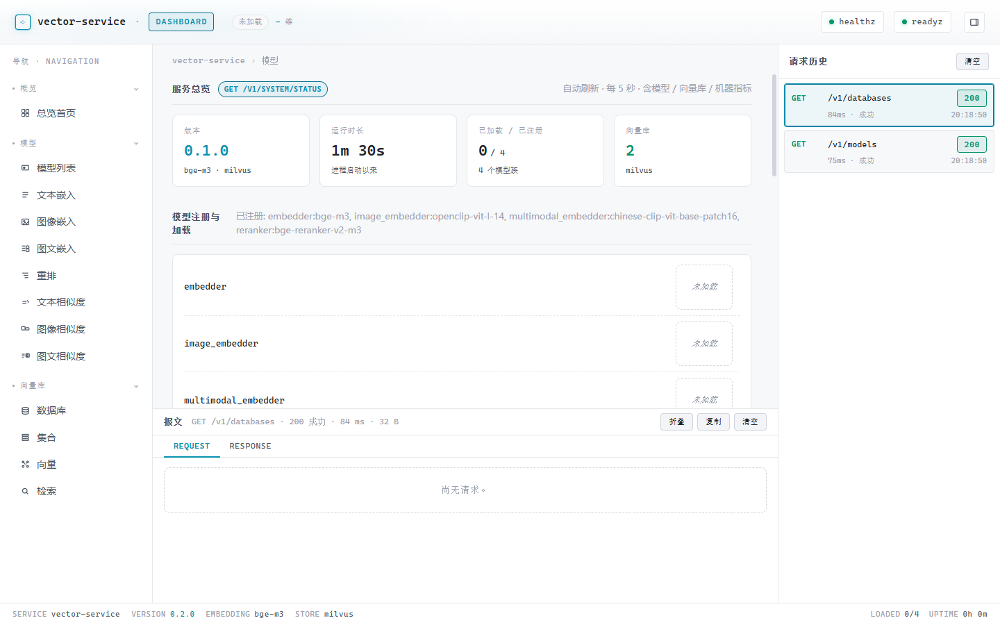
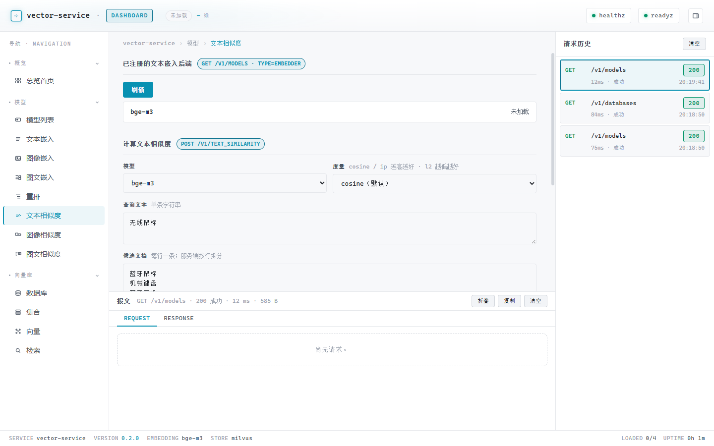

# 快速上手

5 分钟把 `vector-service` 跑起来。

> 详细配置、API、扩展说明都在 [README.md 索引](README.md) 列出。

## 0. 前置条件

- Python ≥ 3.11
- 一台可访问的 Milvus server（standalone / cluster），版本 ≥ 2.4（推荐启用 native database）
- 可选：GPU + CUDA（如需用 torch fp16 后端跑 BGE-M3；否则自动落到 ONNX int8 CPU）

## 1. 准备 `.env`

```bash
cp .env.example .env
```

至少确认：

| 变量 | 含义 | 默认值 |
|------|------|--------|
| `VS_HOST` / `VS_PORT` | 监听地址 | `0.0.0.0` / `8080` |
| `VS_LOG_LEVEL` / `VS_LOG_FORMAT` | 日志级别 / 格式（`json` / `console`） | `INFO` / `json` |
| `VS_EMBEDDING_BACKEND` | 文本嵌入器后端 | `bge-m3` |
| `VS_EMBEDDING_MODEL_DIR` | 模型本地目录 | `./models/bge-m3` |
| `VS_EMBEDDING_AUTO_DOWNLOAD` | 首次启动自动下载模型权重 | `true` |
| `VS_VECTOR_STORE_BACKEND` | 向量库后端（目前只支持 `milvus`） | `milvus` |
| `VS_MILVUS_URI` | Milvus server 地址（gRPC） | `http://localhost:19530` |
| `VS_MILVUS_USER` / `VS_MILVUS_PASSWORD` | 账号密码（启用 auth 时填） | （空） |
| `VS_MILVUS_TOKEN` | 可选 token（优先级高于 user/password） | （空） |
| `VS_MILVUS_TIMEOUT` | 连接 / RPC 超时（秒） | `30` |
| `VS_RERANKER__BACKEND` | reranker 后端 | `bge-reranker-v2-m3` |
| `VS_IMAGE_EMBEDDING__BACKEND` | 图像嵌入器后端 | `openclip-vit-l-14` |
| `VS_MULTIMODAL_EMBEDDING__BACKEND` | 跨模态嵌入器后端 | `chinese-clip-vit-base-patch16` |

完整字段见 [`.env.example`](../.env.example)。字段语义详见 [configuration.md](configuration.md)。

## 2. 启动 Milvus server

参考 [Milvus 官方文档](https://milvus.io/docs/install_standalone-docker.md) 起一个 standalone：

```bash
wget https://github.com/milvus-io/milvus/releases/download/v2.4.10/milvus-standalone-docker-compose.yml -O docker-compose.yml
docker compose up -d
```

确认 `localhost:19530` 可达。

## 3. 安装依赖

```bash
uv venv --python 3.11
uv pip install -e ".[all]"
```

`[all]` 同时装 BGE-M3、pymilvus、open_clip_torch 与 transformers。也可以分开装：`uv pip install -e ".[embed,store,image-embed,multimodal-embed]"`。

## 4. 启动服务

```bash
uvicorn vector_service.main:app --host 0.0.0.0 --port 8080
```

或直接装 console_script：

```bash
vector-service
```

## 5. 访问路径

| 路径 | 内容 |
|------|------|
| `http://127.0.0.1:8080/dashboard` | 自带调试页面（每个 tab 都能点按钮调接口） |
| `http://127.0.0.1:8080/docs` | Swagger UI |
| `http://127.0.0.1:8080/redoc` | ReDoc |
| `http://127.0.0.1:8080/openapi.json` | OpenAPI 文档 |
| `http://127.0.0.1:8080/healthz` | 进程存活 |
| `http://127.0.0.1:8080/readyz` | 嵌入器加载 + Milvus 可达 |
| `http://127.0.0.1:8080/metrics` | Prometheus |


*Dashboard 默认落地页：KPI 总览 + 模型注册表 + 向量库状态 + 机器指标 + GPU 设备卡。*


*新加的「文本相似度」调试面板（侧栏 模型 → 文本相似度）：左选模型 + 度量，中间填查询与候选（按行拆分），底部按所选度量排序展示 `result-row` 列表。*

## 下一步

- API 用法：[api.md](api.md)
- 嵌入/重排子系统详细参数与错误码：[embedding-subsystems.md](embedding-subsystems.md)
- 模型热加载与生命周期：[model-lifecycle.md](model-lifecycle.md)
- 跑测试：[testing.md](testing.md)
